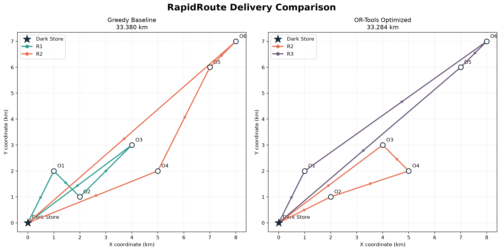
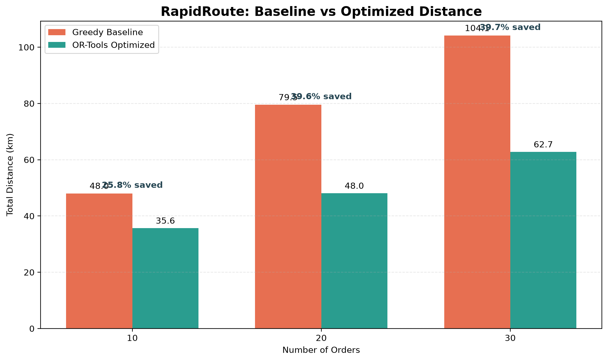

# RapidRoute

Quick commerce promises delivery in minutes. The routes, unfortunately, do not optimize themselves.

RapidRoute is an Operations Research experiment for assigning orders to riders, batching compatible deliveries and optimizing routes from a single dark store.

## What It Handles

- Multiple riders and customer orders
- Rider capacity constraints
- Delivery deadlines
- Order-to-rider allocation
- Delivery sequencing
- Dynamic insertion of new orders
- Route reoptimization
- Greedy versus optimized route comparison
- Reproducible benchmark experiments

## Optimization Approach

RapidRoute models delivery planning as a Capacitated Vehicle Routing Problem with delivery deadlines.

Google OR-Tools is used to minimize total route distance while ensuring:

- Every order is assigned exactly once
- Rider capacities are respected
- Orders are delivered before their deadlines
- Every route begins and ends at the dark store

A deadline-first greedy dispatcher provides the comparison baseline.

## Benchmark Results

The following results use seeded synthetic delivery scenarios, Euclidean distances and a two-second solver limit.

| Orders | Riders | Greedy baseline | Optimized | Distance saved | Runtime |
|---:|---:|---:|---:|---:|---:|
| 10 | 2 | 48.009 km | 35.642 km | 25.76% | 2.006 s |
| 20 | 3 | 79.503 km | 48.047 km | 39.57% | 2.002 s |
| 30 | 4 | 104.095 km | 62.749 km | 39.72% | 2.001 s |

These results demonstrate performance on the included scenarios and are not claims about real-world delivery networks.

## Visual Results





## Run the Project

Install dependencies:

```bash
python -m pip install -r requirements.txt
```

Run the standard comparison:

```bash
python main.py
```

Run dynamic order insertion:

```bash
python -m examples.dynamic_order_demo
```

Run the benchmark:

```bash
python -m examples.benchmark
```

Generate visualizations:

```bash
python -m examples.plot_routes
python -m examples.plot_benchmark
```

Run all tests:

```bash
python -m unittest discover tests
```

## Project Structure

```text
src/optimizers/   Greedy and OR-Tools routing algorithms
src/simulation/   Scenario generation and dynamic dispatch
src/utils/        Distance, time and visualization utilities
examples/         Runnable experiments
tests/            Automated tests
results/          Benchmark output
visuals/          Generated route and benchmark plots
```

## Current Limitations

- Uses synthetic Cartesian coordinates
- Uses Euclidean distance instead of a real road network
- Reoptimizes complete routes after a new order
- Does not model live traffic or rider movement

RapidRoute is intentionally an OR experiment rather than a production delivery platform—one route, constraint and questionable deadline at a time.